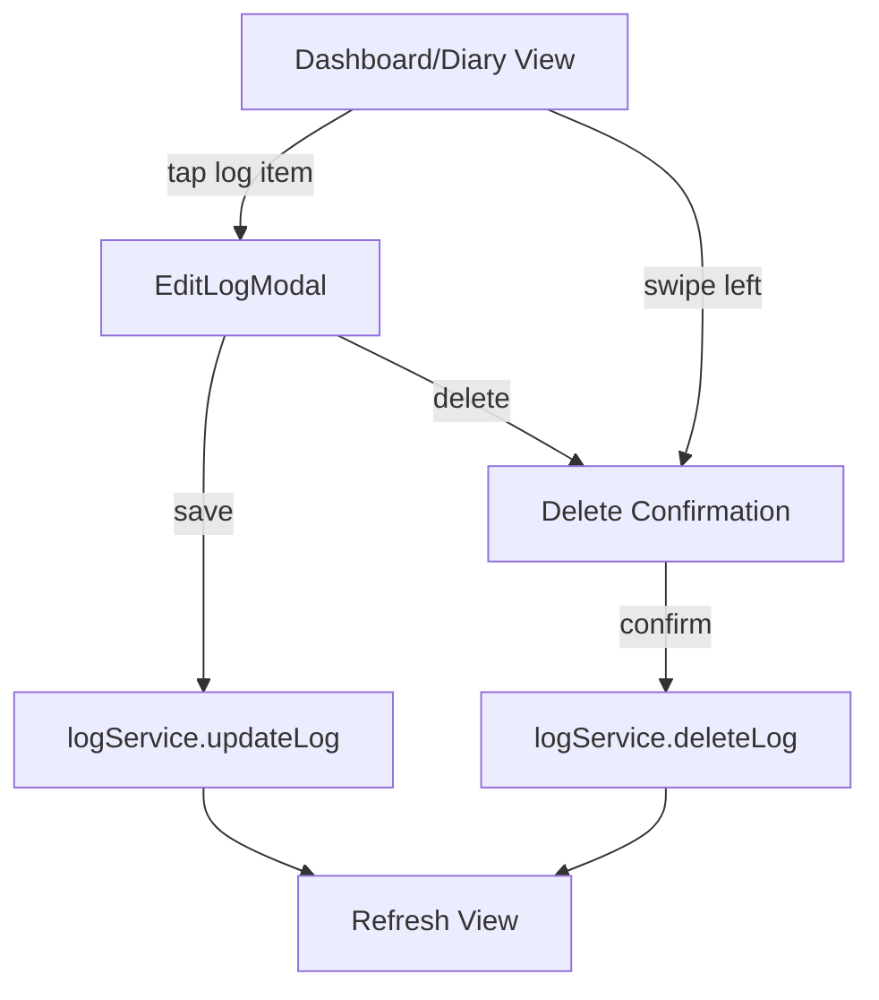

# Edit Food Log Feature Plan

## Overview
Implement the ability to edit and delete food log entries. Users should be able to modify servings, serving type, meal time, date, and specific time logged. Delete functionality should be accessible via swipe gestures on the main view or from the edit modal.

## Requirements Summary
- **Edit Fields**: Servings consumed, serving type (size/unit), meal time (Breakfast/Lunch/Dinner/Snack), date, and specific time
- **No Food Change**: Users cannot change which food was logged (partial editing only)
- **UI Style**: Modal/bottom sheet overlay
- **Delete Options**: 
  - Swipe-to-delete on Dashboard and Diary views
  - Delete button in edit modal

## Database Changes Required

### 1. Add Food Servings Table (Food-Specific Serving Sizes)
Each food can have multiple serving size options with their gram equivalents:

```sql
-- Food-specific serving sizes
CREATE TABLE IF NOT EXISTS food_servings (
  id UUID PRIMARY KEY DEFAULT uuid_generate_v4(),
  food_id UUID REFERENCES foods(id) ON DELETE CASCADE NOT NULL,
  name TEXT NOT NULL,                 -- e.g., 'small', 'medium', 'large', 'cup', 'slice'
  grams NUMERIC NOT NULL,             -- grams for this serving size
  is_default BOOLEAN DEFAULT false,   -- default serving for this food
  UNIQUE(food_id, name)               -- each serving name is unique per food
);

-- Example data:
-- Apple: small=100g, medium=150g, large=200g
-- Banana: small=90g, medium=120g, large=150g
-- Milk: cup=244g, tbsp=15g, gallon=3785g
-- Bread: slice=30g, piece=50g
```

**Benefits**:
- A "small" banana (90g) is different from a "small" apple (100g)
- Each food can have relevant serving types (e.g., "slice" for bread, not for milk)
- AI can populate this when creating foods
- Users can add custom serving sizes

### 2. Update Foods Table for Gram-Based Nutrition
Add per-100g nutrition values for standardized calculations:

```sql
-- Add gram-based nutrition columns to foods
ALTER TABLE foods ADD COLUMN IF NOT EXISTS serving_grams NUMERIC;  -- grams per default serving
ALTER TABLE foods ADD COLUMN IF NOT EXISTS calories_per_100g NUMERIC;
ALTER TABLE foods ADD COLUMN IF NOT EXISTS protein_per_100g NUMERIC;
ALTER TABLE foods ADD COLUMN IF NOT EXISTS carbs_per_100g NUMERIC;
ALTER TABLE foods ADD COLUMN IF NOT EXISTS fat_per_100g NUMERIC;
```

### 3. Add Custom Serving Fields to Logs Table
Allow per-log serving customization:

```sql
-- Add serving override fields to logs table
ALTER TABLE logs ADD COLUMN IF NOT EXISTS food_serving_id UUID REFERENCES food_servings(id);
ALTER TABLE logs ADD COLUMN IF NOT EXISTS custom_serving_grams NUMERIC;  -- actual grams consumed
```

**Logic**:
- If `food_serving_id` is set: use the grams from that food_serving record
- If `custom_serving_grams` is set: use that directly (for manual entry)
- If neither: fall back to food's default serving

### 4. Update Backend Functions
Modify views and functions to use gram-based calculations:

```sql
-- Update daily_summary to use gram-based calculations
CREATE OR REPLACE VIEW daily_summary AS
SELECT 
  l.user_id,
  l.date,
  ROUND(SUM(
    COALESCE(
      f.calories_per_100g * (l.custom_serving_grams / 100) * l.servings_consumed,
      f.calories * l.servings_consumed
    )
  ), 1) AS total_calories,
  ROUND(SUM(
    COALESCE(
      f.protein_per_100g * (l.custom_serving_grams / 100) * l.servings_consumed,
      f.protein * l.servings_consumed
    )
  ), 1) AS total_protein,
  -- ... similar for carbs and fat
FROM logs l
JOIN foods f ON l.food_id = f.id
GROUP BY l.user_id, l.date;
```

**Calculation Logic**:
1. If `custom_serving_grams` is set: use `calories_per_100g * (custom_serving_grams / 100) * servings_consumed`
2. If not set: fall back to `calories * servings_consumed` (legacy behavior)

## Architecture

### Component Structure



### Files to Create/Modify

| File | Action | Description |
|------|--------|-------------|
| `frontend/src/components/common/EditLogModal.js` | Create | Modal component for editing log entries |
| `frontend/src/views/Dashboard.js` | Modify | Add swipe-to-delete, wire up modal |
| `frontend/src/views/Diary.js` | Modify | Add swipe-to-delete, wire up modal |
| `frontend/src/services/logService.js` | Modify | Ensure time_logged is handled properly |
| `frontend/src/main.js` | Modify | Initialize EditLogModal, update route handler |
| `frontend/src/styles/main.css` | Modify | Add swipe action styles |

## Detailed Implementation

### 1. EditLogModal Component

**Location**: `frontend/src/components/common/EditLogModal.js`

**Props**:
- `logId` - ID of the log to edit
- `onSave` - Callback after successful save
- `onDelete` - Callback after successful delete
- `onClose` - Callback when modal is closed

**State**:
- `log` - The full log entry with food data
- `servings` - Current servings value
- `mealTime` - Selected meal time
- `date` - Selected date
- `time` - Selected time (HH:MM format)
- `loading` - Loading state
- `showDeleteConfirm` - Toggle delete confirmation

**UI Elements**:
```
┌─────────────────────────────────────┐
│  Edit Log                      [X]  │
├─────────────────────────────────────┤
│  🍎 Apple                           │
│  95 cal · 0g protein per serving    │
├─────────────────────────────────────┤
│  Serving Size                       │
│  [1.0    ] [medium ▼]               │
│  Quick: [small] [medium] [large]    │
├─────────────────────────────────────┤
│  Servings (multiplier)              │
│  [−]  1.0  [+]                      │
│  [0.5] [1] [1.5] [2]                │
├─────────────────────────────────────┤
│  Meal          Date                 │
│  [Breakfast ▼] [2024-01-15]         │
├─────────────────────────────────────┤
│  Time                               │
│  [08:30]                            │
├─────────────────────────────────────┤
│  Total: 95 cal · 0g protein         │
├─────────────────────────────────────┤
│  [Delete]              [Save]       │
└─────────────────────────────────────┘
```

**Serving Type Options**:
Common serving units to offer in dropdown:
- Size: small, medium, large, extra large
- Weight: g, oz, lb
- Volume: cup, tbsp, tsp, ml, fl oz, liter, gallon
- Count: piece, slice, item, serving

The serving type is stored as `custom_serving_size` and `custom_serving_unit` on the log entry, overriding the food's default serving.

### 2. Swipe-to-Delete Implementation

**Approach**: Use touch events to detect swipe gestures on log items

**Touch Event Flow**:
1. `touchstart` - Record initial X position
2. `touchmove` - Track movement, reveal delete button
3. `touchend` - If swipe > threshold, show delete action

**Visual Feedback**:
- Swipe left reveals red delete button
- Tapping delete shows confirmation dialog
- Swipe right cancels the action

**CSS Classes Needed**:
```css
.diary-item-wrapper {
  position: relative;
  overflow: hidden;
}

.diary-item-swipe-actions {
  position: absolute;
  right: 0;
  top: 0;
  bottom: 0;
  display: flex;
  transform: translateX(100%);
}

.diary-item-swipe-delete {
  background: var(--md-error);
  color: white;
  display: flex;
  align-items: center;
  padding: 0 24px;
}
```

### 3. Delete Confirmation Dialog

A simple confirmation dialog to prevent accidental deletions:

```
┌─────────────────────────────────────┐
│  Delete Log Entry?                  │
│                                     │
│  Are you sure you want to delete    │
│  "Apple" from your food log?        │
│                                     │
│  [Cancel]           [Delete]        │
└─────────────────────────────────────┘
```

### 4. Route Handling Update

The `/log/:id` route currently shows a placeholder. Update to:
1. Open the EditLogModal with the log ID
2. Keep the current view visible behind the modal
3. On close, navigate back to the previous route

### 5. logService Updates

Ensure `updateLog` accepts all editable fields:
- `servings_consumed` - Number
- `meal_time` - String (Breakfast/Lunch/Dinner/Snack)
- `date` - String (YYYY-MM-DD)
- `time_logged` - String (HH:MM)

## Implementation Steps

### Phase 1: EditLogModal Component
1. Create `EditLogModal.js` with basic structure
2. Implement form fields for servings, meal, date, time
3. Add save functionality with validation
4. Add delete button with confirmation
5. Style the modal to match existing design

### Phase 2: Integration
1. Initialize EditLogModal in main.js
2. Update `/log/:id` route handler to open modal
3. Update Dashboard.js click handlers
4. Update Diary.js click handlers

### Phase 3: Swipe-to-Delete
1. Add touch event handlers to diary items
2. Implement swipe animation
3. Add delete button reveal
4. Wire up delete confirmation

### Phase 4: Testing & Polish
1. Test edit flow end-to-end
2. Test delete from modal
3. Test swipe-to-delete
4. Test on mobile devices
5. Handle edge cases (network errors, etc.)

## Technical Considerations

### Touch Event Handling
- Use passive event listeners for better scroll performance
- Handle both touch and mouse events for desktop testing
- Prevent text selection during swipe

### State Management
- Modal state managed by main.js App class
- View refresh triggered after successful edit/delete
- Consider using store for modal state if complexity grows

### Accessibility
- Ensure modal is keyboard navigable
- Add ARIA labels for screen readers
- Focus management when modal opens/closes

### Error Handling
- Show error toast on save/delete failure
- Preserve form state on error
- Offer retry option for network failures

## Files Reference

- Existing modal pattern: [`frontend/src/components/common/AIModal.js`](frontend/src/components/common/AIModal.js)
- Bottom sheet pattern: [`frontend/src/components/common/BottomSheet.js`](frontend/src/components/common/BottomSheet.js)
- Serving controls UI: [`frontend/src/views/AddFood.js`](frontend/src/views/AddFood.js) (lines 253-293)
- Log service: [`frontend/src/services/logService.js`](frontend/src/services/logService.js)
