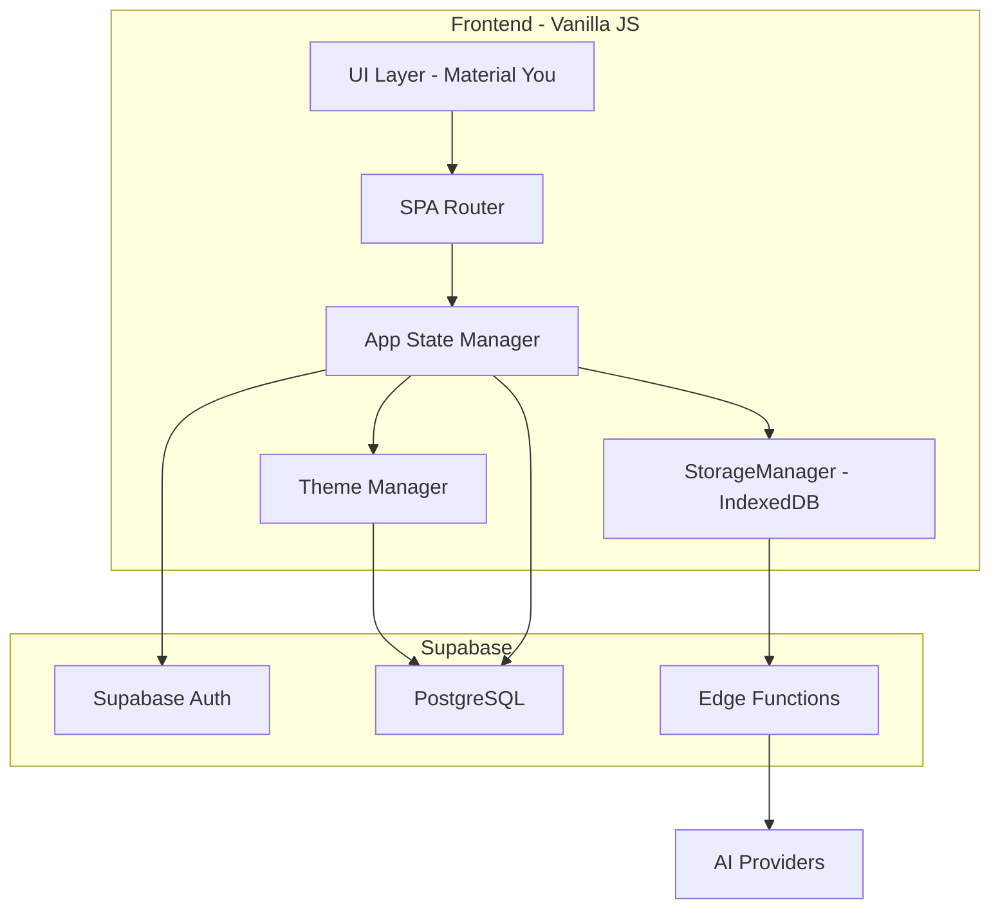
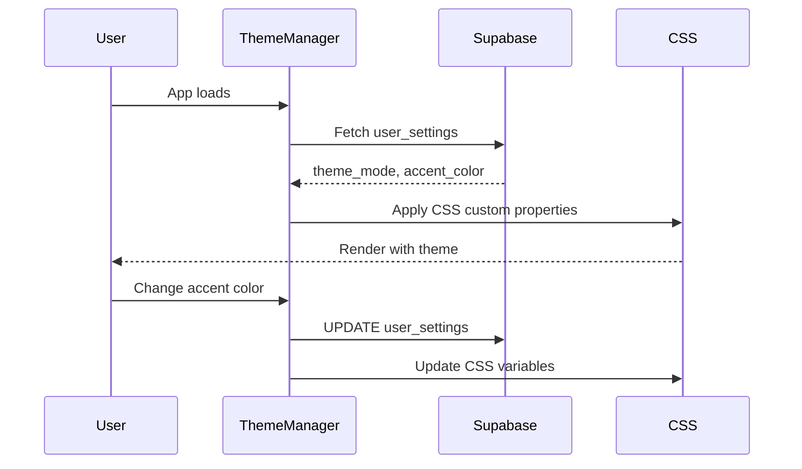
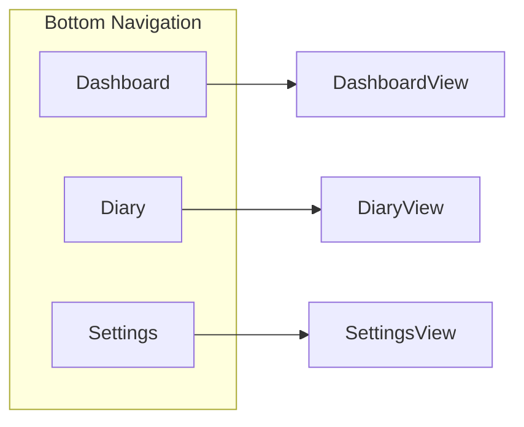

# PWAte Frontend Architecture Plan v2

## Executive Summary

This plan outlines the frontend architecture for PWAte, a Progressive Web App for food tracking with AI-powered logging capabilities. The app features a Material You design system with user-customizable themes persisted to Supabase.

## Key Requirements Summary

### User Requirements (Priority)
1. **Material You Theme**: User-selectable accent color + light/dark/AMOLED modes (stored in Supabase)
2. **Local AI Config**: Provider, API key, and model name stored in IndexedDB (never sent to Supabase)
3. **Simple, Data-Focused UI**: Minimal interface prioritizing data display
4. **Navigation**: Dashboard, Diary, Settings (3 main views)
5. **Logging Modal**: 2 tabs - Text search and Camera (not 3 tabs as in original plan)

### Differences from Original Plan

| Feature | Original Plan | Updated Requirement |
|---------|---------------|---------------------|
| Theme Modes | light/dark/system | light/dark/AMOLED |
| Theme Storage | Not specified | Supabase user_settings table |
| Navigation | 4 tabs with FAB | 3 tabs (Dashboard, Diary, Settings) |
| Logging Tabs | 3 (Cloud Search, AI Text, AI Vision) | 2 (Text, Camera) |
| Diary View | Part of Dashboard | Separate view with timeline |

---

## Architecture Overview



---

## Phase 1: Project Setup & Infrastructure

### 1.1 Initialize Vite Project
- Run `npm create vite@latest frontend -- --template vanilla`
- Configure `vite.config.js` with PWA plugin
- Set up environment variables

### 1.2 Install Dependencies
```bash
npm install @supabase/supabase-js
npm install idb-keyval
npm install -D vite-plugin-pwa
```

### 1.3 Project Structure
```
frontend/
├── index.html
├── main.js                 # App initialization
├── styles/
│   ├── main.css           # Tailwind imports
│   └── material-you.css   # Dynamic theme variables
├── config/
│   └── supabase.js        # Client initialization
├── utils/
│   ├── StorageManager.js  # IndexedDB for AI config
│   ├── dateFormatter.js
│   └── macroCalculator.js
├── router/
│   └── router.js          # History API SPA router
├── state/
│   └── store.js           # Central state management
├── theme/
│   └── ThemeManager.js    # Material You theme system
├── components/
│   ├── navigation/
│   │   ├── TopNavBar.js
│   │   └── BottomNav.js
│   ├── auth/
│   │   └── AuthScreen.js
│   ├── common/
│   │   ├── ProgressBar.js
│   │   ├── Modal.js
│   │   ├── FoodCard.js
│   │   └── DatePicker.js
│   └── logging/
│       ├── LoggingModal.js
│       ├── TextSearchTab.js
│       └── CameraTab.js
├── views/
│   ├── Dashboard.js
│   ├── Diary.js
│   ├── Settings.js
│   ├── FoodDetails.js
│   ├── EditLog.js
│   ├── CreateFood.js
│   └── CreateRecipe.js
└── services/
    ├── foodService.js
    ├── logService.js
    ├── goalsService.js
    ├── settingsService.js
    └── aiService.js
```

---

## Phase 2: Material You Theme System

### 2.1 Theme Architecture

The theme system uses CSS custom properties that are dynamically updated based on user preferences stored in Supabase.



### 2.2 CSS Custom Properties Structure
```css
:root {
  /* Primary accent - dynamically generated */
  --md-primary: #10b981;
  --md-on-primary: #ffffff;
  --md-primary-container: #d1fae5;
  --md-on-primary-container: #00210e;
  
  /* Surface colors - change with theme mode */
  --md-surface: #ffffff;
  --md-on-surface: #1a1a1a;
  --md-surface-variant: #f5f5f5;
  
  /* AMOLED specific */
  --md-surface-amoled: #000000;
}
```

### 2.3 Theme Modes
| Mode | Background | Surface | Description |
|------|------------|---------|-------------|
| Light | #ffffff | #fafafa | Standard light theme |
| Dark | #1a1a1a | #2d2d2d | Material dark theme |
| AMOLED | #000000 | #0a0a0a | Pure black for OLED screens |

### 2.4 Database Migration for AMOLED Support

Run this migration in Supabase SQL Editor:

```sql
-- Update theme_mode constraint to include amoled
ALTER TABLE user_settings DROP CONSTRAINT user_settings_theme_mode_check;
ALTER TABLE user_settings ADD CONSTRAINT user_settings_theme_mode_check 
  CHECK (theme_mode IN ('system', 'light', 'dark', 'amoled'));
```

### 2.5 Material You Color Palette

Preset accent colors for the palette picker:

| Color Name | Hex Code | Description |
|------------|----------|-------------|
| Teal | #10b981 | Default Material You green |
| Blue | #3b82f6 | Classic blue |
| Purple | #8b5cf6 | Vibrant purple |
| Pink | #ec4899 | Playful pink |
| Orange | #f97316 | Energetic orange |
| Red | #ef4444 | Bold red |
| Indigo | #6366f1 | Deep indigo |
| Cyan | #06b6d4 | Fresh cyan |

Each accent color generates a full Material You tonal palette:
- Primary
- On-Primary
- Primary Container
- On-Primary Container
- Secondary (derived)
- Surface variants

---

## Phase 3: Authentication System

### 3.1 Auth Flow
- Listen to `supabase.auth.onAuthStateChange`
- Logged out: Show AuthScreen
- Logged in: Mount app shell with navigation

### 3.2 AuthScreen Component
- Email/password inputs
- Login and Signup buttons
- No email confirmation required (per backend config)
- Clean, Material You styled form

---

## Phase 4: Core UI Shell & Navigation

### 4.1 Navigation Structure



### 4.2 TopNavBar Component
- App title/logo
- Date picker (sticky, updates global state)
- Optional: User avatar menu

### 4.3 BottomNav Component
- 3 tabs: Dashboard, Diary, Settings
- Active state highlighting with accent color
- Hidden on auth screen

---

## Phase 5: Dashboard View

### 5.1 Layout Structure - Summary-First with Expandable Meals
```
┌─────────────────────────────────────┐
│ ◀ January 22, 2026 ▶                │
├─────────────────────────────────────┤
│ ┌─────────────────────────────────┐ │
│ │     Daily Progress              │ │
│ │  Calories    1,850 / 2,000      │ │
│ │  Protein       120 / 150g       │ │
│ │  Carbs         180 / 200g       │ │
│ │  Fat            55 / 65g        │ │
│ └─────────────────────────────────┘ │
├─────────────────────────────────────┤
│ Meals                          ▼    │
│ ┌─────────────────────────────────┐ │
│ │ 🌅 Breakfast        350 cal     │ │
│ │    2 items · 8:30 AM            │ │
│ │    [Expand to see items]        │ │
│ └─────────────────────────────────┘ │
│ ┌─────────────────────────────────┐ │
│ │ ☀️ Lunch            650 cal     │ │
│ │    2 items · 12:30 PM           │ │
│ │    [Expand to see items]        │ │
│ └─────────────────────────────────┘ │
│ ┌─────────────────────────────────┐ │
│ │ 🌙 Dinner             0 cal     │ │
│ │    Tap to add foods             │ │
│ └─────────────────────────────────┘ │
│ ┌─────────────────────────────────┐ │
│ │ 🍎 Snacks          200 cal     │ │
│ │    1 item · 3:00 PM             │ │
│ │    [Expand to see items]        │ │
│ └─────────────────────────────────┘ │
│                                      │
│                    [＋ FAB]          │
└─────────────────────────────────────┘
```

### 5.2 Meal Card Behavior
- **Collapsed State**: Shows meal name, total calories, item count, and time
- **Expanded State**: Shows individual food items with servings
- **Tap meal card**: Expands/collapses to show items
- **Tap individual item**: Opens Food Details view
- **Empty meal**: Shows "Tap to add foods" prompt

### 5.3 Data Fetching
- Fetch `user_goals` for target macros
- Fetch `daily_summary` view for current totals
- Fetch `meal_time_summary` for meal breakdowns
- Fetch individual logs with `time_logged` for display order

---

## Phase 6: Diary View

### 6.1 Timeline Layout
```
┌─────────────────────────────────┐
│ Date Picker                     │
├─────────────────────────────────┤
│ Today's Food Log                │
│                                 │
│ 8:30 AM - Breakfast             │
│ ┌─────────────────────────────┐ │
│ │ Oatmeal with berries        │ │
│ │ 1 serving | 300 cal         │ │
│ └─────────────────────────────┘ │
│                                 │
│ 12:30 PM - Lunch                │
│ ┌─────────────────────────────┐ │
│ │ Grilled chicken salad       │ │
│ │ 1.5 servings | 450 cal      │ │
│ └─────────────────────────────┘ │
│                                 │
│ [FAB + Add Food]                │
└─────────────────────────────────┘
```

### 6.2 Features
- Ordered by `time_logged` (newest column in logs table)
- Tap food item → Food Details view
- Long press → Quick edit menu
- Uses `time_logged` column from migration

---

## Phase 7: Logging View - Full-Screen

### 7.1 Full-Screen Logging Layout
```
┌─────────────────────────────────────┐
│ ← Add Food                          │
├─────────────────────────────────────┤
│ [🔍 Text Search]  [📷 Camera]       │
├─────────────────────────────────────┤
│ Meal: [Breakfast ▼]  Date: Jan 22   │
├─────────────────────────────────────┤
│ 🔍 Search foods...                  │
│                                      │
│ ┌─────────────────────────────────┐ │
│ │ Oatmeal                         │ │
│ │ 150 cal · 5g P · 27g C · 3g F   │ │
│ │ Per 1 cup cooked                │ │
│ │                    [Tap to log] │ │
│ └─────────────────────────────────┘ │
│ ┌─────────────────────────────────┐ │
│ │ Oatmeal, instant                │ │
│ │ 120 cal · 4g P · 20g C · 2g F   │ │
│ │ Per 1 packet                    │ │
│ │                    [Tap to log] │ │
│ └─────────────────────────────────┘ │
│                                      │
│ [＋ Create New Food]                 │
└─────────────────────────────────────┘
```

### 7.2 Text Search Tab
- Full-width search input at top
- Debounced search (300ms delay)
- Query `foods` table with `.ilike()`
- Results show name, macros per serving, serving info
- Tap result → opens serving selector inline or as bottom sheet
- "Create New Food" button at bottom

### 7.3 Camera Tab
```
┌─────────────────────────────────────┐
│ ← Add Food                          │
├─────────────────────────────────────┤
│ [🔍 Text Search]  [📷 Camera]       │
├─────────────────────────────────────┤
│ Meal: [Breakfast ▼]  Date: Jan 22   │
├─────────────────────────────────────┤
│                                      │
│      ┌─────────────────────┐        │
│      │                     │        │
│      │   Camera Preview    │        │
│      │      or             │        │
│      │   [Take Photo]      │        │
│      │                     │        │
│      └─────────────────────┘        │
│                                      │
│      [📷 Take Photo]                 │
│      [📁 Choose from Gallery]        │
│                                      │
└─────────────────────────────────────┘
```

After photo capture:
```
┌─────────────────────────────────────┐
│ ← Verify Food                       │
├─────────────────────────────────────┤
│ [📷 Retake]                         │
├─────────────────────────────────────┤
│ Name: [Grilled Chicken    ]         │
│ Brand: [Tyson             ]         │
│ Serving: [4] [oz▼]                  │
│                                      │
│ Calories: [165]                     │
│ Protein:  [31] g                    │
│ Carbs:   [0] g                      │
│ Fat:     [3.6] g                    │
│                                      │
│ Meal: [Dinner ▼]                    │
│                                      │
│ [Cancel]           [Log Food]        │
└─────────────────────────────────────┘
```

### 7.4 Camera Flow
1. Open camera via `<input type="file" accept="image/*" capture="environment">`
2. Draw image to hidden canvas for compression (max 800px width)
3. Convert to Base64
4. Call `scan-nutrition-label` Edge Function with AI config from IndexedDB
5. Display extracted nutrition in editable form
6. User verifies/edits values
7. Save to `foods` table (if new) and create log entry

### 7.5 Serving Selector
When user taps a food from search:
```
┌─────────────────────────────────────┐
│ ← Log Oatmeal                       │
├─────────────────────────────────────┤
│ Per serving:                         │
│   150 cal · 5g protein              │
│   27g carbs · 3g fat                │
│                                      │
│ Servings:                            │
│   [−]  [1.0]  [＋]                  │
│   or quick select:                   │
│   [0.5] [1] [1.5] [2]               │
│                                      │
│ Your total:                          │
│   150 cal · 5g protein              │
│   27g carbs · 3g fat                │
│                                      │
│ Meal: [Breakfast ▼]                 │
│ Time: [8:30 AM ▼]                   │
│                                      │
│ [Cancel]           [Log Food]        │
└─────────────────────────────────────┘
```

---

## Phase 8: Settings Page

### 8.1 Settings Sections
```
┌─────────────────────────────────┐
│ Settings                        │
├─────────────────────────────────┤
│ Appearance                      │
│ ┌─────────────────────────────┐ │
│ │ Theme: [Light|Dark|AMOLED]  │ │
│ │ Accent Color: [Color Picker]│ │
│ └─────────────────────────────┘ │
├─────────────────────────────────┤
│ Nutrition Goals                 │
│ ┌─────────────────────────────┐ │
│ │ Calories: [2000]            │ │
│ │ Protein: [150] g            │ │
│ │ Carbs: [200] g              │ │
│ │ Fat: [65] g                 │ │
│ └─────────────────────────────┘ │
├─────────────────────────────────┤
│ AI Configuration                │
│ ┌─────────────────────────────┐ │
│ │ Provider: [OpenAI|Anthropic]│ │
│ │ API Key: [••••••••]         │ │
│ │ Model: [gpt-4o-mini]        │ │
│ └─────────────────────────────┘ │
├─────────────────────────────────┤
│ Account                         │
│ ┌─────────────────────────────┐ │
│ │ Email: user@example.com     │ │
│ │ [Log Out]                   │ │
│ └─────────────────────────────┘ │
└─────────────────────────────────┘
```

### 8.2 Data Storage Locations
| Setting | Storage | Reason |
|---------|---------|--------|
| Theme Mode | Supabase `user_settings` | Sync across devices |
| Accent Color | Supabase `user_settings` | Sync across devices |
| Nutrition Goals | Supabase `user_goals` | Per-user data |
| AI Provider | IndexedDB | Security - never sent to DB |
| AI API Key | IndexedDB | Security - never sent to DB |
| AI Model | IndexedDB | Security - never sent to DB |

---

## Phase 9: Food Details & Edit Pages

### 9.1 Food Details View
- Display all nutrition information
- Show brand if available
- Serving size and unit
- Option to log this food
- Option to edit (if user created it)

### 9.2 Edit Log View
- Change servings consumed
- Change meal time
- Change date
- Delete log entry

---

## Phase 10: Recipe & Meal Creation Pages

### 10.1 Create Food View
- Name and brand inputs
- Serving size and unit
- Nutrition inputs (calories, protein, carbs, fat)
- Save to `foods` table with `created_by` set

### 10.2 Create Recipe View
- Recipe name
- Total servings
- Search and add ingredients
- Auto-calculate total macros
- Creates entry in `foods` table
- Links via `recipes` and `recipe_ingredients` tables

---

## Phase 11: PWA Configuration

### 11.1 Vite PWA Plugin Config
```javascript
// vite.config.js
VitePWA({
  registerType: 'autoUpdate',
  manifest: {
    name: 'PWAte',
    short_name: 'PWAte',
    display: 'standalone',
    background_color: '#ffffff',
    theme_color: '#10b981',
    icons: [
      { src: 'icon-192.png', sizes: '192x192', type: 'image/png' },
      { src: 'icon-512.png', sizes: '512x512', type: 'image/png' }
    ]
  },
  workbox: {
    globPatterns: ['**/*.{js,css,html,ico,png,svg}']
  }
})
```

### 11.2 Deployment Config
```json
// vercel.json
{
  "rewrites": [
    { "source": "/(.*)", "destination": "/index.html" }
  ]
}
```

---

## Database Integration Summary

### Tables Used
| Table | Purpose | RLS |
|-------|---------|-----|
| `foods` | Global food database | SELECT all, INSERT auth |
| `logs` | User food diary | User's own only |
| `user_goals` | Daily macro targets | User's own only |
| `user_settings` | Theme & preferences | User's own only |
| `meals` | Saved meal groupings | User's own only |
| `meal_items` | Foods within meals | Via meals |
| `recipes` | Custom recipes | User's own only |
| `recipe_ingredients` | Foods in recipes | Via recipes |

### Views Used
| View | Purpose |
|------|---------|
| `daily_summary` | Aggregated daily macros |
| `meal_time_summary` | Macros per meal time |

### Edge Functions
| Function | Purpose |
|----------|---------|
| `ai-food-log` | Natural language logging |
| `scan-nutrition-label` | Vision-based scanning |

---

## Security Considerations

1. **AI API Keys**: NEVER in Supabase - IndexedDB only
2. **RLS Policies**: All user data protected by `auth.uid()`
3. **Theme Data**: Safe to store in Supabase (non-sensitive)
4. **Auth Tokens**: Handled by Supabase client automatically

---

## Implementation Priority Order

### Core MVP Features (Phase 1-8)
1. **Project Setup** - Vite, dependencies, structure
2. **Theme System** - Material You with Supabase persistence, AMOLED support
3. **Authentication** - Login/signup flow
4. **Navigation Shell** - Top bar with date picker, bottom nav
5. **Dashboard** - Progress bars, expandable meal cards
6. **Logging View** - Full-screen with Text Search and Camera tabs
7. **Diary View** - Timeline of food logs by time
8. **Settings** - Theme picker, goals, AI config

### Post-MVP Features (Phase 9-11)
9. **Food Details/Edit** - View and modify log entries
10. **Recipe/Meal Creation** - Custom foods and meal groupings
11. **PWA Polish** - Manifest, service worker, deployment

---

## Summary of Decisions

| Decision | Choice |
|----------|--------|
| Color Picker | Preset palette of 8 Material You colors |
| Theme Modes | Light, Dark, AMOLED (requires DB migration) |
| Dashboard Layout | Summary-first with expandable meal cards |
| Logging Flow | Full-screen view with tabs |
| FAB Placement | Both Dashboard and Diary views |
| MVP Scope | Core features only (no recipes/meals in v1) |
| AI Config Storage | IndexedDB (never sent to Supabase) |
| Theme Storage | Supabase user_settings table |
