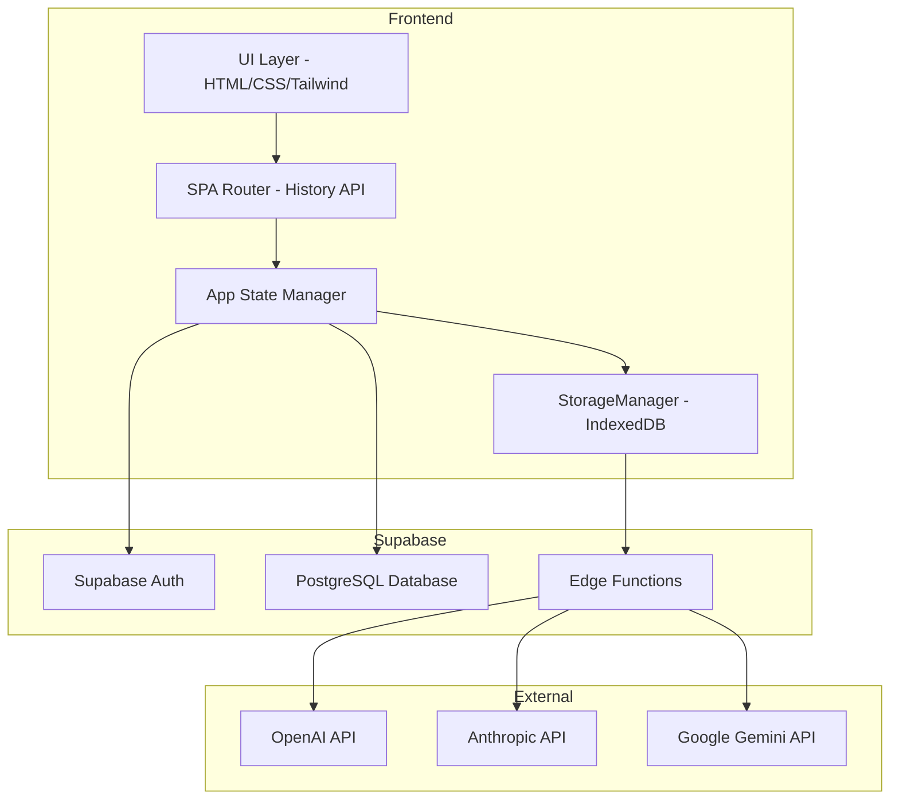
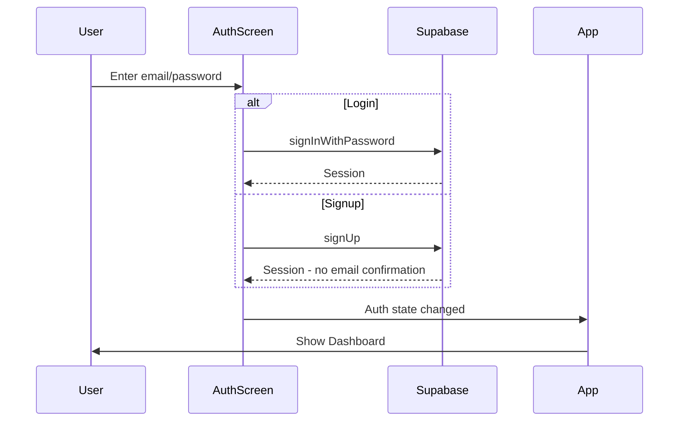
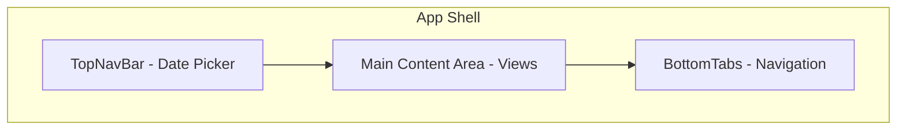
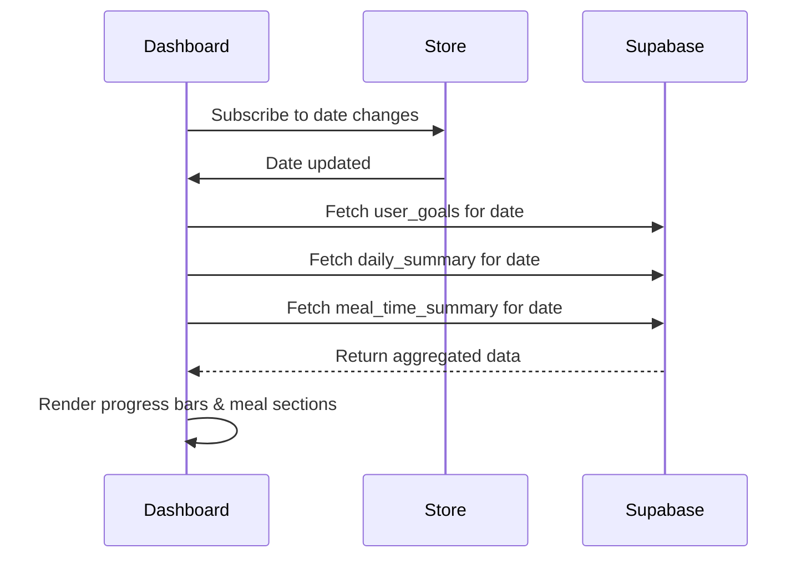
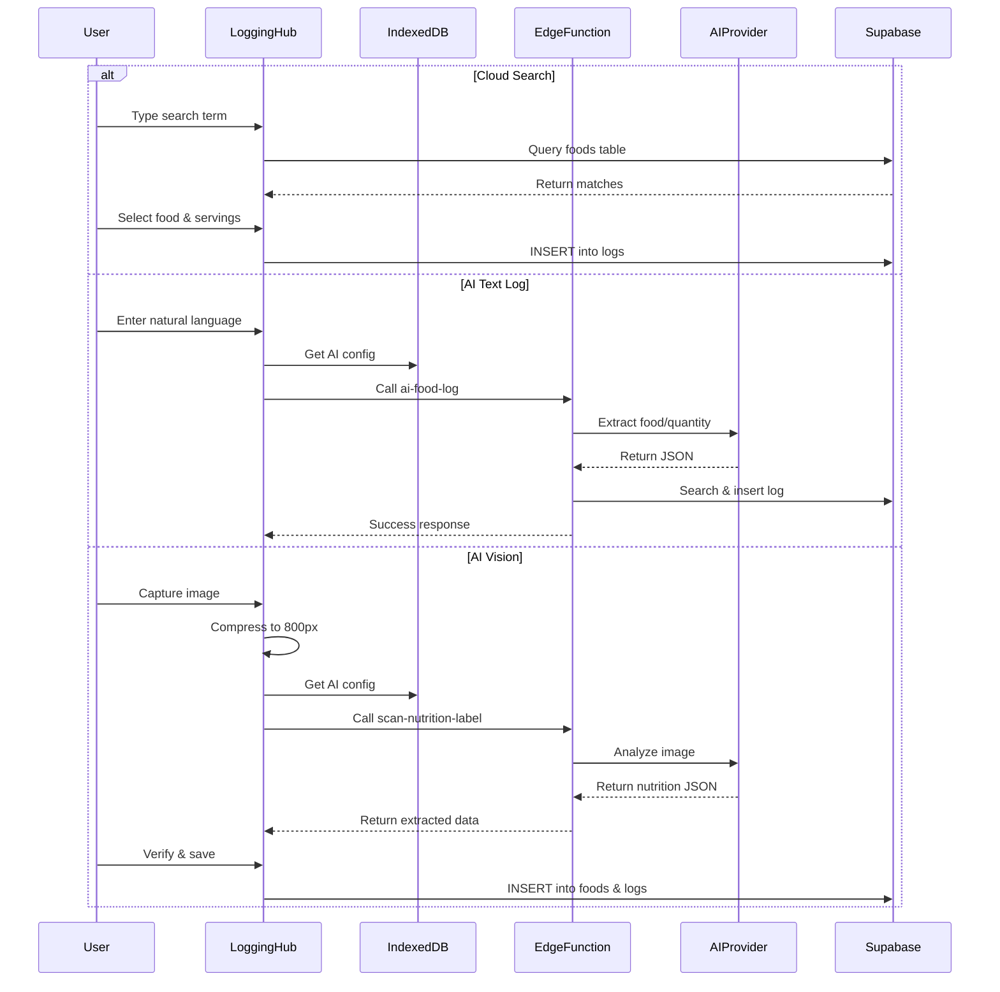

# PWAte Frontend Development Plan

## Overview

This plan outlines the development of PWAte, a Progressive Web App for food tracking with AI-powered logging capabilities. The app uses vanilla JavaScript with Vite, Tailwind CSS, and Supabase for the backend.

## Architecture Summary



---

## Phase 1: Project Setup & Infrastructure

### 1.1 Initialize Vite Project
- [ ] Run `npm create vite@latest` with Vanilla JavaScript template
- [ ] Configure `vite.config.js` with PWA plugin settings
- [ ] Set up environment variables in `.env` file

### 1.2 Install Dependencies
- [ ] Install `@supabase/supabase-js` for backend communication
- [ ] Install `vite-plugin-pwa` for PWA functionality
- [ ] Install `idb-keyval` as IndexedDB wrapper for AI credentials storage
- [ ] Configure Tailwind CSS via Vite plugin

### 1.3 Project Structure
Create the following directory structure:

```
src/
├── index.html              # Main HTML entry point
├── main.js                 # App initialization & auth listener
├── styles/
│   └── main.css           # Tailwind imports & custom styles
├── config/
│   └── supabase.js        # Supabase client initialization
├── utils/
│   ├── StorageManager.js  # IndexedDB wrapper for AI config
│   ├── dateFormatter.js   # Date utilities
│   └── macroCalculator.js # Macro math helpers
├── router/
│   └── router.js          # History API SPA router
├── state/
│   └── store.js           # Central app state management
├── components/
│   ├── navigation/
│   │   ├── TopNavBar.js   # Date picker & user menu
│   │   └── BottomTabs.js  # Mobile tab navigation
│   ├── auth/
│   │   └── AuthScreen.js  # Login/signup form
│   └── common/
│       ├── ProgressBar.js # Reusable progress bar
│       ├── Modal.js       # Reusable modal component
│       └── FoodCard.js    # Food item display card
├── views/
│   ├── Dashboard.js       # View A: Daily Dashboard
│   ├── LoggingHub.js      # View B: Food logging interface
│   ├── MealsRecipes.js    # View C: Meals & Recipes Lab
│   └── Settings.js        # View D: User Settings
└── services/
    ├── foodService.js     # Foods table operations
    ├── logService.js      # Logs table operations
    ├── goalsService.js    # User goals operations
    ├── mealsService.js    # Meals & meal_items operations
    ├── recipesService.js  # Recipes operations
    └── aiService.js       # Edge function calls
```

### 1.4 Environment Configuration
- [ ] Create `.env` with `VITE_SUPABASE_URL` and `VITE_SUPABASE_ANON_KEY`
- [ ] Create `.env.example` for documentation
- [ ] Add `.env` to `.gitignore`

---

## Phase 2: Authentication System

### 2.1 Supabase Client Setup
Create [`src/config/supabase.js`](src/config/supabase.js) to initialize the Supabase client with environment variables.

### 2.2 Auth State Listener
Create [`src/main.js`](src/main.js) with:
- [ ] Initialize Supabase client
- [ ] Set up `supabase.auth.onAuthStateChange` listener
- [ ] Handle session persistence
- [ ] Route to appropriate view based on auth state

### 2.3 Auth Screen Component
Create [`src/components/auth/AuthScreen.js`](src/components/auth/AuthScreen.js):
- [ ] Email/password input form
- [ ] Login button calling `supabase.auth.signInWithPassword()`
- [ ] Signup button calling `supabase.auth.signUp()`
- [ ] Error handling and display
- [ ] Clean, mobile-friendly UI with Tailwind

### 2.4 Auth Flow Diagram



---

## Phase 3: Core UI Shell & Navigation

### 3.1 SPA Router
Create [`src/router/router.js`](src/router/router.js):
- [ ] Implement History API wrapper
- [ ] Handle `popstate` events for back button
- [ ] Route matching for all views
- [ ] 404 handling - redirect to dashboard

### 3.2 App State Manager
Create [`src/state/store.js`](src/state/store.js):
- [ ] Current user object
- [ ] Selected date - default to today
- [ ] Current view/route
- [ ] Daily macro cache
- [ ] Publish/subscribe pattern for state changes

### 3.3 Top Navigation Bar
Create [`src/components/navigation/TopNavBar.js`](src/components/navigation/TopNavBar.js):
- [ ] App logo/title
- [ ] Date picker component - sticky at top
- [ ] Date change updates global state
- [ ] User avatar/menu dropdown

### 3.4 Bottom Tab Navigation
Create [`src/components/navigation/BottomTabs.js`](src/components/navigation/BottomTabs.js):
- [ ] Dashboard tab icon
- [ ] Log Food tab icon - prominent FAB style
- [ ] Meals/Recipes tab icon
- [ ] Settings tab icon
- [ ] Active state highlighting
- [ ] Hidden on auth screen

### 3.5 Main Layout Structure



---

## Phase 4: Daily Dashboard View

### 4.1 Dashboard Component
Create [`src/views/Dashboard.js`](src/views/Dashboard.js):
- [ ] Fetch user goals from `user_goals` table
- [ ] Fetch daily summary from `daily_summary` view
- [ ] Fetch meal time summaries from `meal_time_summary` view
- [ ] Calculate remaining macros

### 4.2 Macro Progress Bars
Create [`src/components/common/ProgressBar.js`](src/components/common/ProgressBar.js):
- [ ] Reusable progress bar component
- [ ] Accept current/target values
- [ ] Color coding: green for on-track, yellow for approaching, red for over
- [ ] Display both count and percentage

### 4.3 Meal Timeline Sections
- [ ] Collapsible sections for each meal time
- [ ] Display Breakfast, Lunch, Dinner, Snack summaries
- [ ] Show calories and macros per meal
- [ ] Expand to show individual food items

### 4.4 Add Food FAB
- [ ] Floating action button positioned bottom-right
- [ ] Navigate to Logging Hub on click
- [ ] Pass current meal time context

### 4.5 Data Flow



---

## Phase 5: Logging Hub

### 5.1 Logging Hub Component
Create [`src/views/LoggingHub.js`](src/views/LoggingHub.js):
- [ ] Tab interface with 3 tabs
- [ ] Meal time selector dropdown
- [ ] Date context from store

### 5.2 Tab 1: Cloud Search
Create search functionality:
- [ ] Text input with debounce - 300ms
- [ ] Query `foods` table with `.ilike()` on name field
- [ ] Display results in scrollable list
- [ ] Limit to 10-20 results

### 5.3 Food Selection Modal
Create [`src/components/common/Modal.js`](src/components/common/Modal.js):
- [ ] Display selected food details
- [ ] Servings input with increment/decrement
- [ ] Calculate preview of macros
- [ ] Confirm button to insert into `logs` table
- [ ] Cancel button to close

### 5.4 Tab 2: AI Text Log
- [ ] Large text area for natural language input
- [ ] Example placeholder text: "I ate 3 eggs and a piece of toast"
- [ ] Submit button
- [ ] Call `ai-food-log` Edge Function
- [ ] Display loading state during API call
- [ ] Show success/error feedback

### 5.5 Tab 3: AI Vision Scanner
- [ ] File input with `accept="image/*" capture="environment"`
- [ ] Hidden canvas for image compression
- [ ] Compress image to max 800px width
- [ ] Convert to Base64
- [ ] Call `scan-nutrition-label` Edge Function
- [ ] Display returned JSON in verification form
- [ ] Allow user to edit before saving to `foods` table

### 5.6 AI Service Layer
Create [`src/services/aiService.js`](src/services/aiService.js):
- [ ] `logFoodWithAI()` - calls ai-food-log edge function
- [ ] `scanNutritionLabel()` - calls scan-nutrition-label edge function
- [ ] Retrieve AI config from IndexedDB before each call
- [ ] Pass provider, API key, and model name to edge functions

### 5.7 Logging Flow



---

## Phase 6: Meals & Recipes Lab

### 6.1 Meals & Recipes Component
Create [`src/views/MealsRecipes.js`](src/views/MealsRecipes.js):
- [ ] Toggle switch between Meals and Recipes views
- [ ] List view of saved items
- [ ] Create new button

### 6.2 Meals Service
Create [`src/services/mealsService.js`](src/services/mealsService.js):
- [ ] `getMeals()` - fetch user's meals with items
- [ ] `createMeal()` - insert into meals table
- [ ] `addMealItem()` - insert into meal_items table
- [ ] `deleteMeal()` - cascade delete

### 6.3 Recipes Service
Create [`src/services/recipesService.js`](src/services/recipesService.js):
- [ ] `getRecipes()` - fetch user's recipes with ingredients
- [ ] `createRecipe()` - insert into recipes table
- [ ] `addRecipeIngredient()` - insert into recipe_ingredients
- [ ] `calculateRecipeMacros()` - sum and divide by servings
- [ ] `logExplodedRecipe()` - call RPC function

### 6.4 Meal Creation Flow
- [ ] Name input for meal
- [ ] Search and add foods from global foods table
- [ ] Set servings per ingredient
- [ ] Save to `meals` and `meal_items` tables

### 6.5 Recipe Creation Flow
- [ ] Name input for recipe
- [ ] Total servings input
- [ ] Search and add ingredients
- [ ] Calculate total macros
- [ ] Create new food entry in `foods` table
- [ ] Link via `generated_food_id`
- [ ] Save to `recipes` and `recipe_ingredients` tables

### 6.6 Recipe Explode Feature
- [ ] Button on recipe detail view
- [ ] Prompt for servings consumed
- [ ] Select meal time
- [ ] Call `log_exploded_recipe` RPC
- [ ] Breaks recipe into individual logs

---

## Phase 7: User Settings

### 7.1 Settings Component
Create [`src/views/Settings.js`](src/views/Settings.js):
- [ ] Section navigation
- [ ] Goals section
- [ ] AI Configuration section
- [ ] Profile section

### 7.2 Goals Form
- [ ] Input fields for target_calories, target_protein, target_carbs, target_fat
- [ ] Save button to update `user_goals` table
- [ ] Upsert logic for date-specific goals

### 7.3 AI Configuration Form
- [ ] Provider dropdown: OpenAI, Anthropic, Gemini
- [ ] API Key input - password type with show/hide toggle
- [ ] Model name input with common defaults
- [ ] Save to IndexedDB via StorageManager
- [ ] Test connection button optional

### 7.4 Storage Manager
Create [`src/utils/StorageManager.js`](src/utils/StorageManager.js):
- [ ] Use `idb-keyval` for simplicity
- [ ] `saveAIConfig()` - store provider, key, model
- [ ] `getAIConfig()` - retrieve all AI settings
- [ ] `clearAIConfig()` - delete stored credentials
- [ ] **CRITICAL**: Never transmit to Supabase Postgres

### 7.5 Profile Section
- [ ] Display email address - read-only
- [ ] Log Out button calling `supabase.auth.signOut()`
- [ ] Account deletion optional for MVP

---

## Phase 8: PWA Configuration & Deployment

### 8.1 Vite PWA Plugin Configuration
Configure in `vite.config.js`:
- [ ] Set `display: 'standalone'`
- [ ] Generate `manifest.json` automatically
- [ ] Configure service worker for static asset caching
- [ ] Set app icons and splash screens
- [ ] Theme color configuration

### 8.2 Manifest Configuration
- [ ] App name: PWAte
- [ ] Short name: PWAte
- [ ] Start URL: /
- [ ] Display mode: standalone
- [ ] Background color and theme color
- [ ] Icon set: 192x192, 512x512

### 8.3 Service Worker
- [ ] Cache static assets: HTML, CSS, JS, images
- [ ] Runtime caching for API calls optional
- [ ] Offline fallback page
- [ ] Note: Offline database syncing is out of scope for MVP

### 8.4 Deployment Configuration
- [ ] Create `vercel.json` for SPA routing:
  ```json
  {
    "rewrites": [
      { "source": "/(.*)", "destination": "/index.html" }
    ]
  }
  ```
- [ ] Alternative: GitHub Pages with 404.html redirect hack
- [ ] Set environment variables in hosting platform

### 8.5 Build & Deploy Steps
- [ ] Run `npm run build`
- [ ] Test production build locally
- [ ] Deploy to chosen platform
- [ ] Verify PWA installation prompt works
- [ ] Test on mobile device

---

## Database Integration Summary

### Tables Used
| Table | Purpose | RLS Policy |
|-------|---------|------------|
| `foods` | Global food database | SELECT all, INSERT authenticated |
| `logs` | User food diary | User's own records only |
| `user_goals` | Daily macro targets | User's own records only |
| `meals` | Saved meal groupings | User's own records only |
| `meal_items` | Foods within meals | Via meals ownership |
| `recipes` | Custom food recipes | User's own records only |
| `recipe_ingredients` | Foods within recipes | Via recipes ownership |

### Views Used
| View | Purpose |
|------|---------|
| `daily_summary` | Aggregated daily macros |
| `meal_time_summary` | Macros per meal time |

### Edge Functions
| Function | Purpose |
|----------|---------|
| `ai-food-log` | Natural language food logging |
| `scan-nutrition-label` | Vision-based label scanning |

### RPC Function
| Function | Purpose |
|----------|---------|
| `log_exploded_recipe` | Break recipe into individual logs |

---

## Security Considerations

1. **AI API Keys**: NEVER store in Supabase - use IndexedDB only
2. **RLS Policies**: All user data protected by `auth.uid()` checks
3. **Environment Variables**: Supabase URL and Anon Key are safe to expose
4. **Auth Tokens**: Handled automatically by Supabase client

---

## Testing Checklist

### Authentication
- [ ] Sign up creates account and default goals
- [ ] Login works with correct credentials
- [ ] Error messages display for failed auth
- [ ] Logout clears session
- [ ] Session persists across page refresh

### Dashboard
- [ ] Date picker updates all data
- [ ] Progress bars calculate correctly
- [ ] Meal sections show correct totals
- [ ] FAB navigates to logging

### Logging
- [ ] Cloud search returns results
- [ ] Food selection inserts log correctly
- [ ] AI text log processes natural language
- [ ] AI vision scanner extracts nutrition data
- [ ] All logs appear in dashboard after refresh

### Meals & Recipes
- [ ] Create meal with multiple foods
- [ ] Create recipe with calculated macros
- [ ] Explode recipe creates individual logs

### Settings
- [ ] Goals update saves to database
- [ ] AI config saves to IndexedDB
- [ ] Logout works from settings

### PWA
- [ ] App installs on mobile
- [ ] App works offline for cached content
- [ ] Icons display correctly
- [ ] Splash screen shows on launch

---

## Recommended Development Order

1. **Week 1**: Phase 1-3 - Project setup, auth, navigation shell
2. **Week 2**: Phase 4-5 - Dashboard and core logging features
3. **Week 3**: Phase 6-7 - Meals/recipes and settings
4. **Week 4**: Phase 8 - PWA polish and deployment

This plan provides a complete roadmap for building the PWAte frontend. Each phase builds on the previous, allowing for iterative development and testing.
