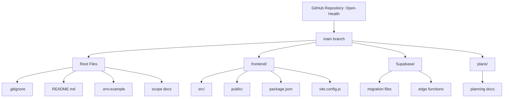

# GitHub Repository Setup Plan: Open Health

## Overview
Create a new private GitHub repository called "Open Health" and commit the entire PWAte project folder.

## Current State
- Project location: `c:/RandallEngineering/PWAte`
- No existing git repository at root level
- Contains frontend (Vite/Vanilla JS PWA) and Supabase backend files
- Has `.env` files with sensitive credentials that must NOT be committed
- Has `node_modules` and `dist` directories that should be excluded

## Steps

### 1. Create Root-Level .gitignore
Create a comprehensive `.gitignore` file at the project root to exclude:
- Environment files (`.env`, `.env.local`, `*.local`)
- Dependencies (`node_modules/`)
- Build outputs (`dist/`, `dist-ssr/`)
- IDE files (`.vscode/`, `.idea/`)
- OS files (`.DS_Store`, `Thumbs.db`)
- Log files (`*.log`, `npm-debug.log*`)
- Kilocode directory (`.kilocode/`)

### 2. Initialize Git Repository
```bash
git init
```

### 3. Create GitHub Repository
Using GitHub CLI:
```bash
gh repo create "Open-Health" --private --description "Open Health - A Progressive Web App for health tracking" --source=. --remote=origin
```

### 4. Stage All Files
```bash
git add .
```

### 5. Create Initial Commit
```bash
git commit -m "Initial commit: Open Health PWA project"
```

### 6. Push to GitHub
```bash
git push -u origin main
```
Note: May need to set branch name to main first:
```bash
git branch -M main
```

## Files to be Committed
Based on the project structure, the following will be committed:

### Root Level
- `.env.example` - Template for environment variables
- `README.md` - Project documentation
- `frontend_scope.md` - Frontend scope document
- `mvp_scope.md` - MVP scope document
- `.gitignore` - Git ignore rules (to be created)

### Frontend Directory
- `frontend/package.json` - NPM dependencies
- `frontend/package-lock.json` - Dependency lock file
- `frontend/index.html` - Entry HTML file
- `frontend/vite.config.js` - Vite configuration
- `frontend/vercel.json` - Vercel deployment config
- `frontend/public/` - Static assets
- `frontend/src/` - Source code (components, services, views, etc.)

### Supabase Directory
- `Supabase/*.sql` - Migration files
- `Supabase/*.ts` - Edge functions
- `Supabase/SQL-Setup.txt` - SQL setup instructions

### Plans Directory
- `plans/*.md` - Planning documents

## Files to be Excluded (via .gitignore)
- `.env` - Contains sensitive Supabase credentials
- `frontend/.env` - Contains sensitive Supabase credentials
- `frontend/node_modules/` - Dependencies (can be reinstalled)
- `frontend/dist/` - Build output
- `.kilocode/` - IDE/tool specific directory

## Security Considerations
- `.env` files contain sensitive Supabase URL and anon key
- These files are already in the existing `.gitignore` at frontend level
- A root-level `.gitignore` will ensure comprehensive exclusion

## Diagram: Repository Structure After Setup



## Next Steps After Setup
1. Verify repository on GitHub
2. Ensure sensitive files are not visible in the repository
3. Set up branch protection rules if needed
4. Add collaborators if necessary
