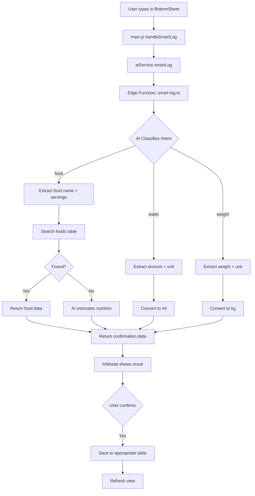
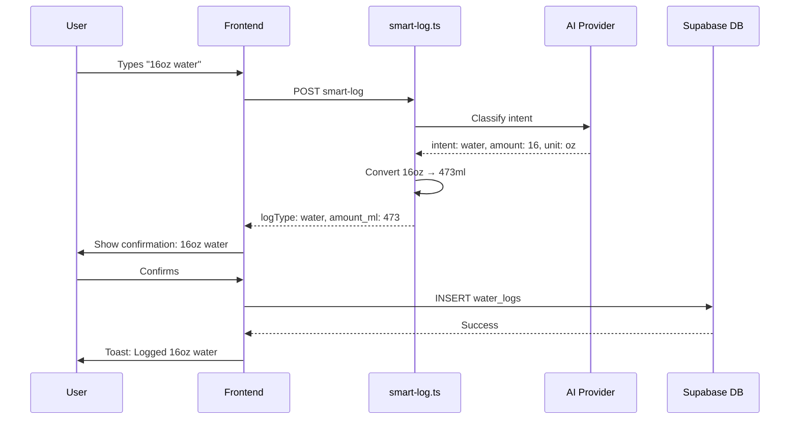

# Quick Log "Type Anything" Feature Plan

## Overview

The "Type Anything" feature allows users to log food, water, or weight using natural language. The AI determines the intent and extracts relevant data, returning a confirmation screen with all fields populated.

## Current State Analysis

### What Exists
- **Frontend Components**: FabSpeedDial, BottomSheet, AIModal (already has UI for food/water/weight)
- **Edge Functions**: `ai-food-log.ts` (food only), `scan-nutrition-label.ts` (vision)
- **Database Tables**: `foods`, `logs`, `user_goals`, `user_settings`, `meals`, `recipes`

### What's Missing
- Database tables for `water_logs` and `weight_logs`
- Smart intent detection in edge function
- Unit conversion logic (oz→ml, lbs→kg)
- Frontend services for water/weight operations

---

## Architecture



---

## Implementation Details

### 1. Database Schema

#### water_logs table
```sql
CREATE TABLE IF NOT EXISTS water_logs (
  id UUID PRIMARY KEY DEFAULT uuid_generate_v4(),
  user_id UUID REFERENCES auth.users(id) NOT NULL DEFAULT auth.uid(),
  date DATE NOT NULL DEFAULT CURRENT_DATE,
  amount_ml NUMERIC NOT NULL,  -- Stored in milliliters
  created_at TIMESTAMPTZ DEFAULT NOW()
);

-- RLS
ALTER TABLE water_logs ENABLE ROW LEVEL SECURITY;
CREATE POLICY "Manage own water logs" ON water_logs FOR ALL USING (auth.uid() = user_id);

-- Index for quick queries
CREATE INDEX idx_water_logs_user_date ON water_logs(user_id, date);
```

#### weight_logs table
```sql
CREATE TABLE IF NOT EXISTS weight_logs (
  id UUID PRIMARY KEY DEFAULT uuid_generate_v4(),
  user_id UUID REFERENCES auth.users(id) NOT NULL DEFAULT auth.uid(),
  date DATE NOT NULL DEFAULT CURRENT_DATE,
  weight_kg NUMERIC NOT NULL,  -- Stored in kilograms
  notes TEXT,
  created_at TIMESTAMPTZ DEFAULT NOW()
);

-- RLS
ALTER TABLE weight_logs ENABLE ROW LEVEL SECURITY;
CREATE POLICY "Manage own weight logs" ON weight_logs FOR ALL USING (auth.uid() = user_id);

-- Index for quick queries
CREATE INDEX idx_weight_logs_user_date ON weight_logs(user_id, date);
```

### 2. Edge Function: smart-log.ts

This replaces/augments `ai-food-log.ts` with intent classification.

#### Request Format
```typescript
interface SmartLogRequest {
  provider: string;
  ai_api_key: string;
  model_name: string;
  user_input: string;
  date: string;
  meal_time?: string;
}
```

#### Response Format
```typescript
interface SmartLogResponse {
  // Common fields
  logType: 'food' | 'water' | 'weight';
  
  // Food-specific
  food_not_found?: boolean;
  search_term?: string;
  servings?: number;
  estimated_nutrition?: {
    name: string;
    brand?: string;
    serving_size: number;
    serving_unit: string;
    calories: number;
    protein: number;
    carbs: number;
    fat: number;
  };
  logged_food?: string;  // If found and auto-logged
  
  // Water-specific
  amount_ml?: number;    // Always in ml
  display_amount?: number;
  display_unit?: string;
  
  // Weight-specific  
  weight_kg?: number;    // Always in kg
  display_weight?: number;
  display_unit?: string;
}
```

#### AI System Prompt
```
You are a smart logging assistant. Analyze the user's input and classify their intent.

Return ONLY a valid JSON object with these fields:
{
  "intent": "food" | "water" | "weight",
  "confidence": 0.0-1.0,
  
  // For food:
  "search_term": "food name to search",
  "servings": number,
  
  // For water:
  "amount": number,
  "unit": "oz" | "ml" | "cups" | "liters" | "gallons",
  
  // For weight:
  "weight": number,
  "unit": "lbs" | "kg" | "stone"
}

Examples:
- "I had 2 scrambled eggs" → {"intent": "food", "search_term": "scrambled eggs", "servings": 2}
- "Drank 16oz of water" → {"intent": "water", "amount": 16, "unit": "oz"}
- "I weigh 180 lbs" → {"intent": "weight", "weight": 180, "unit": "lbs"}
- "My weight is 82kg" → {"intent": "weight", "weight": 82, "unit": "kg"}
```

#### Unit Conversions
```typescript
// Water conversions to ml
const WATER_CONVERSIONS = {
  oz: 29.5735,
  ml: 1,
  cups: 236.588,
  liters: 1000,
  gallons: 3785.41
};

// Weight conversions to kg
const WEIGHT_CONVERSIONS = {
  lbs: 0.453592,
  kg: 1,
  stone: 6.35029
};
```

### 3. Frontend Services

#### waterService.js (new file)
```javascript
class WaterService {
  async logWater(amountMl, date) { ... }
  async getWaterByDate(date) { ... }
  async getDailyWaterTotal(date) { ... }
  async deleteWaterLog(id) { ... }
}
```

#### weightService.js (new file)
```javascript
class WeightService {
  async logWeight(weightKg, date, notes) { ... }
  async getWeightByDate(date) { ... }
  async getWeightHistory(limit) { ... }
  async deleteWeightLog(id) { ... }
}
```

### 4. Frontend Changes

#### aiService.js
Add new method:
```javascript
async smartLog(userInput, date, mealTime) {
  // Calls smart-log edge function
  // Returns classified result
}
```

#### main.js handleSmartLog
```javascript
async handleSmartLog(text) {
  bottomSheet.close()
  aiModal.showThinking()
  
  const result = await aiService.smartLog(text, date, mealTime)
  
  // Result includes logType: 'food' | 'water' | 'weight'
  aiModal.showResult(result)
}
```

#### main.js confirmLog
```javascript
async confirmLog(result) {
  switch (result.logType) {
    case 'food':
      // Existing food logic
      break
    case 'water':
      await waterService.logWater(result.amount_ml, date)
      break
    case 'weight':
      await weightService.logWeight(result.weight_kg, date)
      break
  }
}
```

---

## File Changes Summary

### New Files
| File | Purpose |
|------|---------|
| `Supabase/smart-log.ts` | New edge function with intent classification |
| `Supabase/water-weight-migration.sql` | Database migration |
| `frontend/src/services/waterService.js` | Water logging operations |
| `frontend/src/services/weightService.js` | Weight logging operations |

### Modified Files
| File | Changes |
|------|---------|
| `frontend/src/services/aiService.js` | Add `smartLog()` method |
| `frontend/src/main.js` | Update `handleSmartLog()` and `confirmLog()` |
| `frontend/src/components/common/AIModal.js` | Already has water/weight UI |

---

## Edge Function Flow



---

## Testing Checklist

- [ ] Food logging still works with existing foods
- [ ] Food logging with AI estimation for unknown foods
- [ ] Water logging with various units (oz, ml, cups, liters)
- [ ] Weight logging with various units (lbs, kg, stone)
- [ ] Confirmation screen shows correct data
- [ ] Data persists correctly in database
- [ ] RLS policies prevent cross-user access
- [ ] Error handling for AI failures
- [ ] Error handling for missing AI config

---

## Deployment Steps

1. Run SQL migration in Supabase dashboard
2. Deploy new edge function: `supabase functions deploy smart-log`
3. Update frontend code
4. Test end-to-end flow
5. Optionally deprecate `ai-food-log.ts` once `smart-log.ts` is stable
