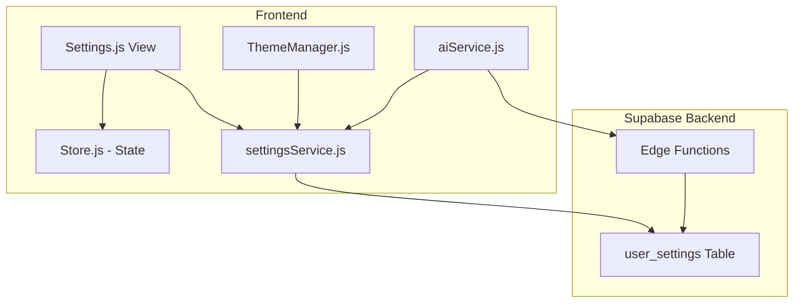
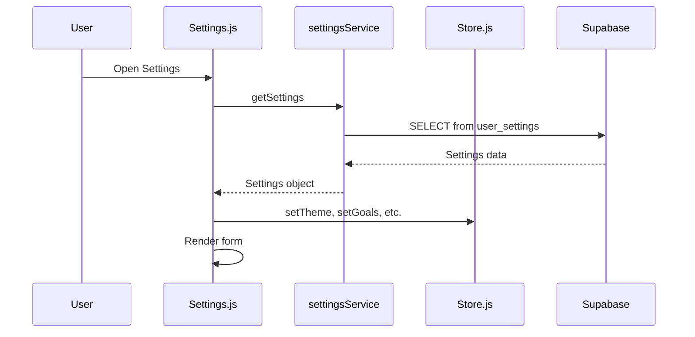
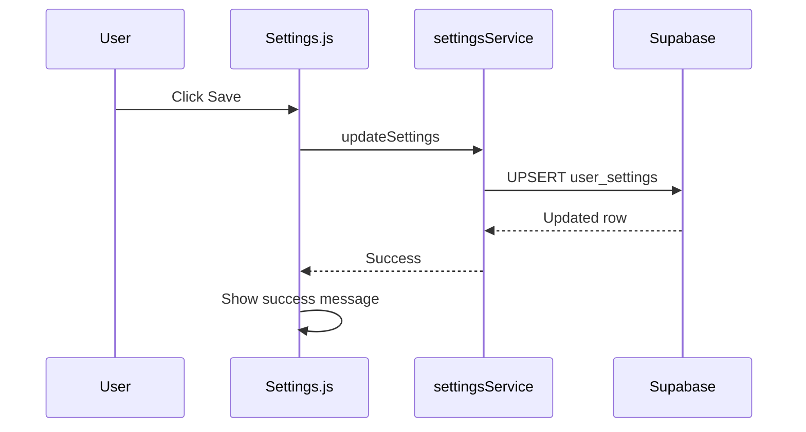

# User Settings Expansion Plan

## Overview

This plan outlines the expansion of user settings to include:
- **AI Configuration**: Move from IndexedDB to backend (Supabase)
- **Theme Settings**: Already partially implemented, ensure full backend sync
- **Unit Preferences**: New feature for measurement units
- **Quick Add Water Sizes**: 3 preferred water sizes for quick logging
- **User Profile**: Birthday, sex, height
- **Fitness Experience**: Cardio and lifting experience levels

## Current State Analysis

### Frontend (IndexedDB - to be migrated)
- AI provider, API key, model name stored in IndexedDB via [`StorageManager.js`](frontend/src/utils/StorageManager.js)
- Note: API keys are sensitive - we need to decide on encryption approach

### Frontend (Supabase - already working)
- Theme mode and accent color in [`user_settings`](Supabase/user-settings-migration.sql) table
- Managed via [`settingsService.js`](frontend/src/services/settingsService.js) and [`ThemeManager.js`](frontend/src/theme/ThemeManager.js)

### Backend (Supabase)
- [`user_settings`](Supabase/user-settings-migration.sql) table exists with theme settings
- RLS policies already configured for user-specific data

---

## Database Schema Changes

### New `user_settings` Table Columns

```sql
-- AI Configuration (moved from IndexedDB)
ai_provider TEXT CHECK (ai_provider IN ('openai', 'anthropic', 'gemini')),
ai_api_key TEXT,  -- Consider encryption at application level
ai_model_name TEXT,

-- Unit Preferences
weight_unit TEXT CHECK (weight_unit IN ('lbs', 'kg')) DEFAULT 'lbs',
height_unit TEXT CHECK (height_unit IN ('ft', 'cm')) DEFAULT 'ft',
water_unit TEXT CHECK (water_unit IN ('oz', 'ml')) DEFAULT 'oz',
distance_unit TEXT CHECK (distance_unit IN ('mi', 'km')) DEFAULT 'mi',

-- Quick Add Water Sizes (in ml for storage, converted for display)
quick_water_size_1 NUMERIC DEFAULT 236.588,  -- 8oz / 1 cup
quick_water_size_2 NUMERIC DEFAULT 473.176,  -- 16oz / 1 pint
quick_water_size_3 NUMERIC DEFAULT 709.765,  -- 24oz / 1.5 pints

-- User Profile
birthday DATE,
sex TEXT CHECK (sex IN ('male', 'female', 'other', 'prefer_not_to_say')),
height_cm NUMERIC,  -- Stored in cm, converted for display

-- Fitness Experience
cardio_experience TEXT CHECK (cardio_experience IN ('none', 'beginner', 'intermediate', 'advanced')) DEFAULT 'none',
lifting_experience TEXT CHECK (lifting_experience IN ('none', 'beginner', 'intermediate', 'advanced')) DEFAULT 'none',
```

---

## Architecture Diagram



---

## Implementation Tasks

### 1. Backend - SQL Migration
Create [`Supabase/user-settings-expansion-migration.sql`](Supabase/user-settings-expansion-migration.sql) with:
- [ ] Add all new columns to `user_settings` table
- [ ] Update default values trigger for new users
- [ ] Add comments for documentation

### 2. Frontend - Service Layer

#### [`settingsService.js`](frontend/src/services/settingsService.js)
- [ ] Add methods for fetching/saving AI config
- [ ] Add methods for unit preferences
- [ ] Add methods for quick water sizes
- [ ] Add methods for user profile
- [ ] Add methods for fitness experience

#### [`aiService.js`](frontend/src/services/aiService.js)
- [ ] Update to fetch AI config from backend via settingsService
- [ ] Remove dependency on StorageManager for AI config

#### [`StorageManager.js`](frontend/src/utils/StorageManager.js)
- [ ] Remove AI config methods (no longer needed)
- [ ] Keep for potential future local caching needs

### 3. Frontend - State Management

#### [`store.js`](frontend/src/state/store.js)
- [ ] Add `userSettings` to state object
- [ ] Add `setUserSettings()` method
- [ ] Initialize settings on user login

### 4. Frontend - UI Components

#### [`Settings.js`](frontend/src/views/Settings.js)
- [ ] Add Profile Section with birthday, sex, height inputs
- [ ] Add Units Section with preference dropdowns
- [ ] Add Quick Water Sizes Section with customizable sizes
- [ ] Add Fitness Experience Section
- [ ] Update AI Config Section to save to backend
- [ ] Add form validation and error handling

#### [`ThemeManager.js`](frontend/src/theme/ThemeManager.js)
- [ ] Ensure theme settings sync with backend on init
- [ ] Update to use settingsService instead of direct Supabase calls

---

## Data Flow

### Settings Load Flow


### Settings Save Flow


---

## Security Considerations

### AI API Key Storage
**Important Decision**: API keys are sensitive credentials. Options:

1. **Store as plain text** (current IndexedDB approach)
   - Pros: Simple implementation
   - Cons: Visible in database, potential security risk

2. **Encrypt before storage**
   - Pros: Keys not visible in plain text
   - Cons: Need key management, still reversible

3. **Keep in IndexedDB** (current approach)
   - Pros: Never sent to server, most secure
   - Cons: Lost on device clear, not synced

**Recommendation**: Keep AI API keys in IndexedDB for security. Only store provider and model name in backend for UX convenience.

---

## UI Mockup - Settings Sections

```
┌─────────────────────────────────────┐
│ Settings                            │
├─────────────────────────────────────┤
│ ▼ Profile                           │
│   Birthday: [Date Picker]           │
│   Sex: [Dropdown]                   │
│   Height: [Input] [Unit Toggle]     │
├─────────────────────────────────────┤
│ ▼ Appearance                        │
│   Theme: [System] [Light] [Dark]    │
│   Accent Color: [Color Options]     │
├─────────────────────────────────────┤
│ ▼ Units                             │
│   Weight: [lbs/kg]                  │
│   Height: [ft/cm]                   │
│   Water: [oz/ml]                    │
│   Distance: [mi/km]                 │
├─────────────────────────────────────┤
│ ▼ Quick Water Sizes                 │
│   Size 1: [Input] oz                │
│   Size 2: [Input] oz                │
│   Size 3: [Input] oz                │
├─────────────────────────────────────┤
│ ▼ Fitness Experience                │
│   Cardio: [None/Beginner/Int/Adv]   │
│   Lifting: [None/Beginner/Int/Adv]  │
├─────────────────────────────────────┤
│ ▼ AI Configuration                  │
│   Provider: [Dropdown]              │
│   API Key: [Password Input]         │
│   Model: [Text Input]               │
│   Note: API key stored locally      │
├─────────────────────────────────────┤
│ ▼ Nutrition Goals                   │
│   Calories: [Input]                 │
│   Protein: [Input] g                │
│   Carbs: [Input] g                  │
│   Fat: [Input] g                    │
├─────────────────────────────────────┤
│ ▼ Account                           │
│   Email: user@example.com           │
│   [Log Out]                         │
└─────────────────────────────────────┘
```

---

## Files to Modify

| File | Changes |
|------|---------|
| `Supabase/user-settings-expansion-migration.sql` | New migration file |
| `frontend/src/services/settingsService.js` | Add new methods |
| `frontend/src/services/aiService.js` | Update config fetching |
| `frontend/src/utils/StorageManager.js` | Remove AI config methods |
| `frontend/src/state/store.js` | Add userSettings state |
| `frontend/src/views/Settings.js` | Add new sections |
| `frontend/src/theme/ThemeManager.js` | Use settingsService |

---

## Questions for Clarification

1. **AI API Key Storage**: Should we keep API keys in IndexedDB (more secure) or move to backend (better UX for multi-device)?

2. **Height Input**: Should we show a single input with unit toggle, or separate ft/in inputs for imperial?

3. **Quick Water Sizes**: Should these be preset options the user can choose from, or fully customizable values?

4. **Default Water Sizes**: Are the default sizes (8oz, 16oz, 24oz) appropriate, or should we use different defaults?
