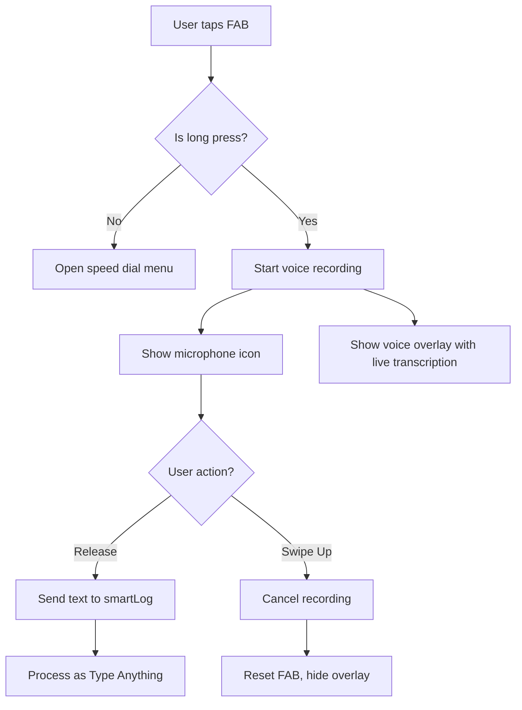

# Voice Input Feature Plan - FAB Long-Press Voice Recording

## Overview
Add voice input capability to the existing FAB (Floating Action Button) through long-press/hold interaction. When the user long-presses the FAB, it will enable voice recording, show live transcription, and on release, send the transcribed text to the AI smart log feature.

## User Interactions

| Interaction | Behavior |
|-------------|----------|
| **Tap (short click)** | Opens the FAB speed dial menu (current behavior) |
| **Long press/hold** | Starts voice recording, shows microphone icon and live transcription overlay |
| **Release (while recording)** | Sends transcribed text to AI smart log, continues like "Type Anything" |
| **Swipe up (while recording)** | Cancels the recording without sending anything |

## Architecture

### Components to Modify

1. **[`FabSpeedDial.js`](frontend/src/components/common/FabSpeedDial.js)** - Add long-press detection, recording state, and voice events
2. **[`main.js`](frontend/src/main.js)** - Add voice recording handler and integrate with smartLog
3. **[`main.css`](frontend/src/styles/main.css)** - Add recording state styles and voice overlay

### New Components to Create

1. **VoiceRecordingOverlay** - Inline class or function to render the recording UI overlay

### Mermaid Diagram - Flow



## Implementation Details

### 1. Modify FabSpeedDial.js

**Add to constructor:**
- `this.isRecording = false`
- `this.onVoiceStart = null` - callback for voice recording start
- `this.onVoiceEnd = null` - callback for voice recording end (with transcript)
- `this.onVoiceCancel = null` - callback for voice recording cancel

**Add new methods:**
- `startRecording()` - Switch to microphone icon, set recording state
- `stopRecording()` - Reset icon, trigger onVoiceEnd with transcript
- `cancelRecording()` - Reset icon, trigger onVoiceCancel
- `updateDOM()` - Update icon based on recording state

**Add event listeners for long-press:**
- Use `mousedown`/`touchstart` to start a timer
- Use `mouseup`/`touchend` to check if long-press completed
- Add `touchmove` for swipe-up gesture detection

### 2. Voice Recording Overlay

**HTML Structure:**
```html
<div id="voice-overlay" class="voice-overlay">
  <div class="voice-indicator">
    <svg class="mic-icon">...</svg>
    <span class="recording-dot"></span>
  </div>
  <div class="transcription-text" id="transcription-text">
    Listening...
  </div>
  <div class="swipe-hint">Swipe up to cancel</div>
</div>
```

**States:**
- `listening` - Initial state, shows "Listening..."
- `transcribing` - Shows live text as user speaks
- `processing` - Shows "Processing..." after release
- `hidden` - Hidden when not recording

### 3. Web Speech API Integration

**Browser APIs:**
- Use `window.SpeechRecognition` or `window.webkitSpeechRecognition`
- Handle both desktop (Chrome, Edge, Safari) and mobile browsers

**Events to handle:**
- `onresult` - Update transcription text in real-time
- `onerror` - Handle errors (no speech, network, etc.)
- `onend` - Called when speech ends naturally

### 4. Integration with Smart Log

In `main.js`, add handler:

```javascript
handleVoiceRecording(transcript) {
  if (transcript && transcript.trim()) {
    // Call smartLog with the transcribed text
    this.handleSmartLog(transcript.trim())
  }
}
```

### 5. CSS Styles

**Recording state for FAB:**
- `.fab-main.recording` - Microphone icon, pulsing animation
- `.fab-container.recording-mode` - Hide menu items, show only recording FAB

**Voice overlay:**
- `.voice-overlay` - Full-screen semi-transparent overlay
- `.voice-indicator` - Pulsing microphone icon
- `.transcription-text` - Live transcription display
- `.swipe-hint` - Instruction text at bottom
- `.voice-overlay.swiping` - Visual feedback when swiping up

## Acceptance Criteria

1. ✅ Tapping FAB opens speed dial menu (unchanged behavior)
2. ✅ Long-press (500ms) on FAB starts voice recording
3. ✅ FAB icon changes to microphone during recording
4. ✅ FAB menu is disabled during recording
5. ✅ Live transcription appears in overlay as user speaks
6. ✅ "Swipe up to cancel" hint is visible
7. ✅ Releasing FAB sends transcript to smartLog
8. ✅ Swiping up cancels recording and hides overlay
9. ✅ Error handling for browsers without speech recognition support

## File Changes Summary

| File | Changes |
|------|---------|
| `frontend/src/components/common/FabSpeedDial.js` | Add long-press detection, recording state, new callbacks |
| `frontend/src/main.js` | Add voice event handlers, integrate with smartLog |
| `frontend/src/styles/main.css` | Add recording styles, voice overlay styles |

## Edge Cases

1. **No speech recognition support** - Show toast/alert, fall back to normal behavior
2. **User releases too quickly** - Consider minimum hold time (200ms) before starting recording
3. **Empty transcript** - Don't call smartLog, just reset
4. **Speech recognition error** - Show error in overlay, allow retry
5. **App backgrounded during recording** - Cancel recording gracefully

## Overview
Add voice input capability to the existing FAB (Floating Action Button) through long-press/hold interaction. When the user long-presses the FAB, it will enable voice recording, show live transcription, and on release, send the transcribed text to the AI smart log feature.

## User Interactions

| Interaction | Behavior |
|-------------|----------|
| **Tap (short click)** | Opens the FAB speed dial menu (current behavior) |
| **Long press/hold** | Starts voice recording, shows microphone icon and live transcription overlay |
| **Release (while recording)** | Sends transcribed text to AI smart log, continues like "Type Anything" |
| **Swipe up (while recording)** | Cancels the recording without sending anything |

## Architecture

### Components to Modify

1. **[`FabSpeedDial.js`](frontend/src/components/common/FabSpeedDial.js)** - Add long-press detection, recording state, and voice events
2. **[`main.js`](frontend/src/main.js)** - Add voice recording handler and integrate with smartLog
3. **[`main.css`](frontend/src/styles/main.css)** - Add recording state styles and voice overlay

### New Components to Create

1. **VoiceRecordingOverlay** - Inline class or function to render the recording UI overlay

### Mermaid Diagram - Flow


## Implementation Details

### 1. Modify FabSpeedDial.js

**Add to constructor:**
- `this.isRecording = false`
- `this.onVoiceStart = null` - callback for voice recording start
- `this.onVoiceEnd = null` - callback for voice recording end (with transcript)
- `this.onVoiceCancel = null` - callback for voice recording cancel

**Add new methods:**
- `startRecording()` - Switch to microphone icon, set recording state
- `stopRecording()` - Reset icon, trigger onVoiceEnd with transcript
- `cancelRecording()` - Reset icon, trigger onVoiceCancel
- `updateDOM()` - Update icon based on recording state

**Add event listeners for long-press:**
- Use `mousedown`/`touchstart` to start a timer
- Use `mouseup`/`touchend` to check if long-press completed
- Add `touchmove` for swipe-up gesture detection

### 2. Voice Recording Overlay

**HTML Structure:**
```html
<div id="voice-overlay" class="voice-overlay">
  <div class="voice-indicator">
    <svg class="mic-icon">...</svg>
    <span class="recording-dot"></span>
  </div>
  <div class="transcription-text" id="transcription-text">
    Listening...
  </div>
  <div class="swipe-hint">Swipe up to cancel</div>
</div>
```

**States:**
- `listening` - Initial state, shows "Listening..."
- `transcribing` - Shows live text as user speaks
- `processing` - Shows "Processing..." after release
- `hidden` - Hidden when not recording

### 3. Web Speech API Integration

**Browser APIs:**
- Use `window.SpeechRecognition` or `window.webkitSpeechRecognition`
- Handle both desktop (Chrome, Edge, Safari) and mobile browsers

**Events to handle:**
- `onresult` - Update transcription text in real-time
- `onerror` - Handle errors (no speech, network, etc.)
- `onend` - Called when speech ends naturally

### 4. Integration with Smart Log

In `main.js`, add handler:

```javascript
handleVoiceRecording(transcript) {
  if (transcript && transcript.trim()) {
    // Call smartLog with the transcribed text
    this.handleSmartLog(transcript.trim())
  }
}
```

### 5. CSS Styles

**Recording state for FAB:**
- `.fab-main.recording` - Microphone icon, pulsing animation
- `.fab-container.recording-mode` - Hide menu items, show only recording FAB

**Voice overlay:**
- `.voice-overlay` - Full-screen semi-transparent overlay
- `.voice-indicator` - Pulsing microphone icon
- `.transcription-text` - Live transcription display
- `.swipe-hint` - Instruction text at bottom
- `.voice-overlay.swiping` - Visual feedback when swiping up

## Acceptance Criteria

1. ✅ Tapping FAB opens speed dial menu (unchanged behavior)
2. ✅ Long-press (500ms) on FAB starts voice recording
3. ✅ FAB icon changes to microphone during recording
4. ✅ FAB menu is disabled during recording
5. ✅ Live transcription appears in overlay as user speaks
6. ✅ "Swipe up to cancel" hint is visible
7. ✅ Releasing FAB sends transcript to smartLog
8. ✅ Swiping up cancels recording and hides overlay
9. ✅ Error handling for browsers without speech recognition support

## File Changes Summary

| File | Changes |
|------|---------|
| `frontend/src/components/common/FabSpeedDial.js` | Add long-press detection, recording state, new callbacks |
| `frontend/src/main.js` | Add voice event handlers, integrate with smartLog |
| `frontend/src/styles/main.css` | Add recording styles, voice overlay styles |

## Edge Cases

1. **No speech recognition support** - Show toast/alert, fall back to normal behavior
2. **User releases too quickly** - Consider minimum hold time (200ms) before starting recording
3. **Empty transcript** - Don't call smartLog, just reset
4. **Speech recognition error** - Show error in overlay, allow retry
5. **App backgrounded during recording** - Cancel recording gracefully

